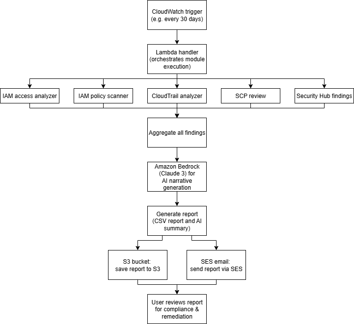
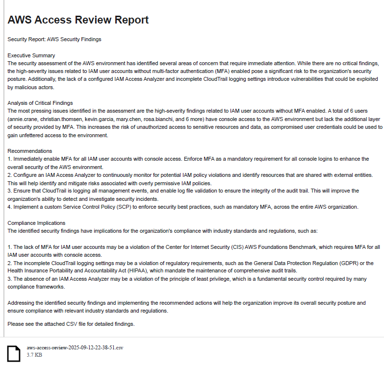
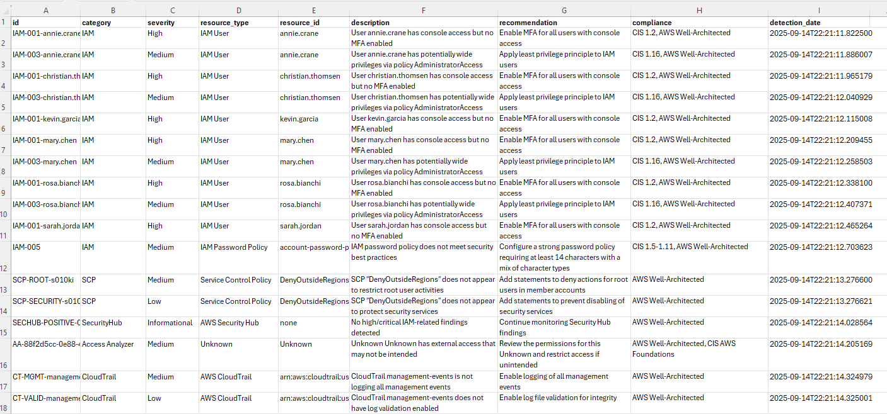

# AWS Automated Access Review (learning edition)

---

## Table of contents
- [About this project](#about-this-project)
- [Logic flow](#logic-flow)
- [Setup and report output](#setup-and-report-output---quick-overview)
- [Core building blocks](#core-building-blocks---what-makes-this-project-work)
- [How it all fits together](#how-it-all-fits-together)
- [Key challenges](#key-challenges-and-fixes)
- [What I learned](#what-i-learned)
- [How to reproduce this project](#how-to-reproduce-this-project)
- [Resources](#resources)

---

## About this project

This AWS security tool automates access reviews by collecting findings from IAM Access Analyzer, Security Hub, CloudTrail and more. It converts technical data into actionable compliance reports and AI-generated summaries (from Amazon Bedrock). This project is based on a git clone of [this repo](https://github.com/ajy0127/aws_automated_access_review). 

This README is not about re-documenting the code from the cloned repo. Instead, it focuses on:
- My personal learning journey as an AWS beginner.
- The challenges I faced.
- How I troubleshot and fixed issues.
- Key concepts and takeaways for others new to AWS.

My goal is to help beginners avoid the same roadblocks I hit and explain things where the AWS docs can be vague.

---

## Logic Flow



---

## Setup and report output - quick overview

Set up instructions: [Quick Start Guide](https://github.com/ajy0127/aws_automated_access_review#quick-start-guide).

#### Output formats:

<details> <summary> <strong>Sample AI-generated output (sent via email)</strong> (click to expand)</summary>



</details>

<details> <summary> <strong>Sample CSV output</strong> (click to expand)</summary>



</details>

---

## Core building blocks - what makes this project work

If you’re new to AWS, focus on these 3 AWS services first:

1. AWS CloudFormation: sets up the infrastructure (IaC).
2. AWS Lambda: runs the logic (serverless code execution).
3. Amazon Bedrock: generates human-readable AI summaries.

Once you understand these, the rest falls into place.

### 1. AWS CloudFormation (IaC)

Instead of manually creating AWS resources, CloudFormation defines everything in a YAML template named ```access-review-real.yaml```. The template is found [here](https://github.com/ajy0127/aws_automated_access_review/tree/main/templates).

CloudFormation automatically sets up the:
- Lambda function
- IAM roles & permissions
- S3 bucket (for CSV reports)
- SES configuration (for emails)
- CloudWatch scheduled trigger (runs every 30 days)

Benefit of CloudFormation: repeatable deployments with no manual setup.

### 2. AWS Lambda (how the code runs)

The [```index.py```](https://github.com/ajy0127/aws_automated_access_review/tree/main/src/lambda) file is where the Lambda function logic lives. This file contains the entry-point function:

```python
def handler(event, context):
```
Every time the Lamda runs, it:
1. collects security data from IAM, CloudTrail, and Security Hub.
2. generates a CSV report.
3. uploads report to S3.
4. calls Amazon Bedrock for AI summary.
5. sends email via SES.

#### If you're new to Lambda, read [```index.py```](https://github.com/ajy0127/aws_automated_access_review/tree/main/src/lambda) from top to bottom, then follow how it imports and calls "helper" modules.

#### Lamda "helper" modules:
The ```index.py``` file doesn’t do all the work by itself. It uses "helper" modules from the [```/modules```](https://github.com/ajy0127/aws_automated_access_review/tree/main/src/lambda/modules) folder.
Each module handles one specific task. 
<details> <summary>Here’s what they do: (click to expand)</summary>

| Module                        | What it does                                            |
| ----------------------------- | ------------------------------------------------------- |
| `iam_findings.py`             | Scans IAM users, roles, and password policies           |
| `scp_findings.py`             | Reviews Service Control Policies from AWS Organizations |
| `securityhub_findings.py`     | Pulls findings from AWS Security Hub                    |
| `access_analyzer_findings.py` | Detects risky external access with IAM Access Analyzer  |
| `cloudtrail_findings.py`      | Looks for suspicious or missing logs in CloudTrail      |
| `reporting.py`                | Generates the CSV and uploads it to S3                  |
| `narrative.py`                | Creates the AI-generated summary using Amazon Bedrock   |
| `email_utils.py`              | Sends email reports via Amazon SES                      |
</details>

### 3. Amazon Bedrock (AI-generated summary)

The AI summary process is handled by the [```bedrock_integration.py```](https://github.com/ajy0127/aws_automated_access_review/tree/main/src/lambda) module. Here's what it does:

- Formats findings into a text prompt.
- Sends it to the AI model (Claude 3 Haiku).
- Returns an easy to read summary.
- Falls back to a default if Bedrock fails.

This makes reports useful for non-technical readers or executives who need high-level insights, not raw CSVs.

---

## How it all fits together

1. You deploy the project using the CloudFormation template.
2. AWS creates all the needed infrastructure for you.
3. The Lambda function runs on a schedule.
4. It collects data, generates a report, uses AI to summarize, uploads to S3 and emails the result.
5. Emails the report to stakeholders via SES.

All of this is fully automated and there's no need to log into the console once it's deployed.

---

## Key challenges and fixes

These are the real-world issues I faced and how I solved them:

#### 1. Bash scripts don’t work in PowerShell.
- PowerShell errors with ./scripts/deploy.sh.
- Fix: I installed and used Use Git Bash on Windows.

#### 2. Bedrock model mismatch.
- The original code used an outdated model ID (claude-v2) which failed silently.
- Fix: I updated the model ID in `bedrock_integration.py` to Claude 3 Haiku model.

#### 3. Lambda logging can be misleading sometimes.
- Lambda logs initially showed “IAM Access Analyzer findings collected” even when no findings were returned due to missing analyzer configuration. This required careful reading of both CloudWatch logs and the generated report to discover the inconsistency.
- Fix: I manually created an external access analyzer.

#### 4. CloudTrail incomplete findings.
- Only write operations were tracked which led to incomplete findings from the CloudTrail module.
- Fix: I reconfigured CloudTrail to log all management events for more complete analysis.

With these fixes, my deployment succeeded: reports generated, uploaded to S3, summarized by Bedrock, and emailed via SES.

---

## What I learned

This project forced me to go beyond deployment and into real AWS troubleshooting.

### AWS Security Services

- IAM Access Analyzer only works if an analyzer exists.
- Findings are not retroactive. You must re-run Lambda after config changes.
- CloudTrail must log all management events for useful results.

### Serverless architecture & DevOps

- IaC (CloudFormation) saved me hours during re-testing.
- CloudWatch Logs are essential to debug:
    - Empty findings
    - SES email failures
    - Bedrock integration errors

### Amazon Bedrock (Claude 3)

- Model version mismatches result in silent failures.
- You must stay current with Bedrock’s available models.

---

## How to reproduce this project

If you’d like to try it yourself:
1. Clone the original repo: [Automated Access Review](https://github.com/ajy0127/aws_automated_access_review).
2. Follow the [Quick Start Guide](https://github.com/ajy0127/aws_automated_access_review#quick-start-guide) in that repo.
3. Apply these beginner fixes:
    - Use Git Bash on Windows.
    - Create an IAM Access Analyzer first.
    -  Update Bedrock model ID to Claude 3 Haiku.
    -  Configure CloudTrail to log all management events.
4. Check CloudWatch Logs after deployment to confirm everything is working.

---

## Resources

Original project repo: [Automated Access Review](https://github.com/ajy0127/aws_automated_access_review).

Big thanks to the original author for making this project open-source and for the opportunity to explore how AWS services work together in a real-world scenario.

---
